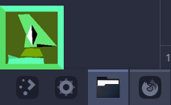
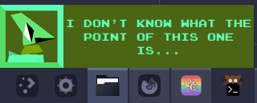

# pet-drilly
Recruit Drilly from the game Garn47 as your desktop pet!



Sometimes they make noises or say things (just like in the game).



## Installation

Clone the repo and install dependencies with:
```
git clone https://github.com/portasynthinca3/pet-drilly.git
cd pet-drilly
poetry install
```

Install the provided `joystix monospace.otf` font.

Tweak configuration options in `pet-drilly.py` (it's obvious where they are and
what they do).

Start Drilly with:
```
poetry run ./pet-drilly.py
```

## Example systemd user unit
```
[Unit]
Description=Pet Drilly

[Service]
Type=simple
WorkingDirectory=/path/to/pet-drilly
Environment="DISPLAY=:1"
ExecStart=sh -c "poetry run python pet-drilly.py"
Restart=on-failure
Slice=session.slice

[Install]
WantedBy=default.target
```

## Acknowledgements
Drilly is from the game [Garn47](https://floombo.itch.io/garn47). Animations and
voice samples were taken from the [game wiki](https://garn47.miraheze.org/wiki/Drilly).
